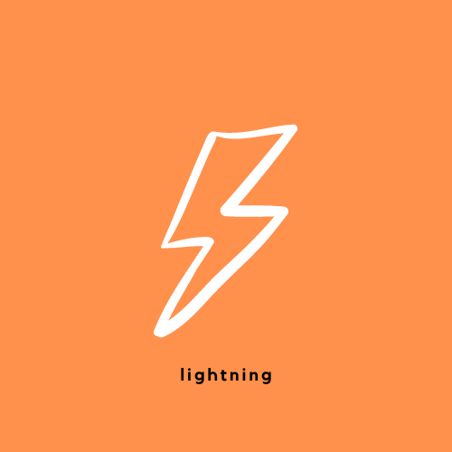
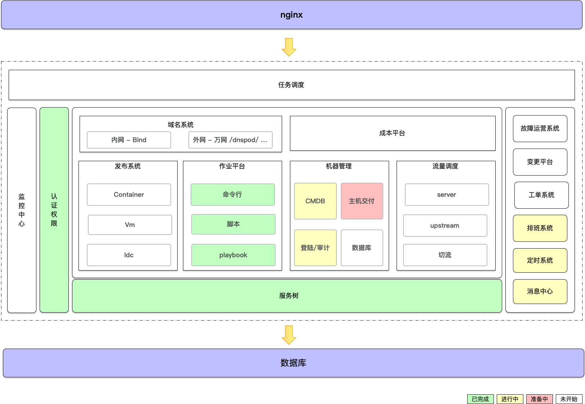

# MeetUp

[多云云主机生命周期管理 第一期 2021-04-25 已结束]()

[灵活的CMDB系统 第二期 **2021-06** 预告]

# 闪电

**特点**：以 `服务` 为中心，快速建立服务资源的组织关系

## 项目描述

本项目 `2021-01-11` 立项，有**5**位热爱 编码的小伙伴利用业余时间开发。

秉承着 以`业务服务`为中心 打造的一款通用/易用 **DevOps** 产品，是我们自大的诉求，我们用自已的经验和能力在开发这款产品上

以`业务服务树` 为中心，联动

- SSH登陆权限
- CMDB
- 作业平台
- 多云管理
- 流量调度
- 发布系统
- 域名管理
- 监控管理
- 配置管理

以 `vue + element-ui`为前端，提供用户的常规操作；以*Python* 和 *Go* 为后端提供 API业务功能。

开源只是一个这个产品的开始，2021年我们会继续大力持续迭代。

**项目核心成员**
- [世成]()
- [胜才]()
- [嘉亮]()
- [海泉]()
- [满柏]()
- [帅波]()

## 模块架构

## 项目地址

[项目Demo](http://www.aiops724.com/)

## 安装

`Lightning` 项目有三部分组成，1个前端 + 2个后端, 分别对应三个仓库，每个仓库中都有与之对应的项目介绍和安装流程，请知悉。

- [WEB前端](https://github.com/zhengyansheng/lightning-fe) 
- [Python后端](https://github.com/zhengyansheng/lightning-ops)
- [Go后端](https://github.com/zhengyansheng/lightning-go)

## 如何使用它

## 功能交流

**群已满，无法自动扫码入群，扫个人微信单独发邀请入群，备注 lightning**

## 成为项目贡献者
> 如果你对这个项目感兴趣，可以加入我们，一起做有兴趣的事情。

- 备注口令: join lightning 

## License

[GPL 3.0](./LICENSE)

## 问题

### 为什么后端要有 Python 和 Go 两种语言？

起初的原因是5位成员中，对编码语言喜爱不同。

另外一个原因是，因为在 `DevOps`领域中，可以准确的说是 先Python统领，然后在有Go，这2种语言都是大趋势，若同时使用效果会更佳。

